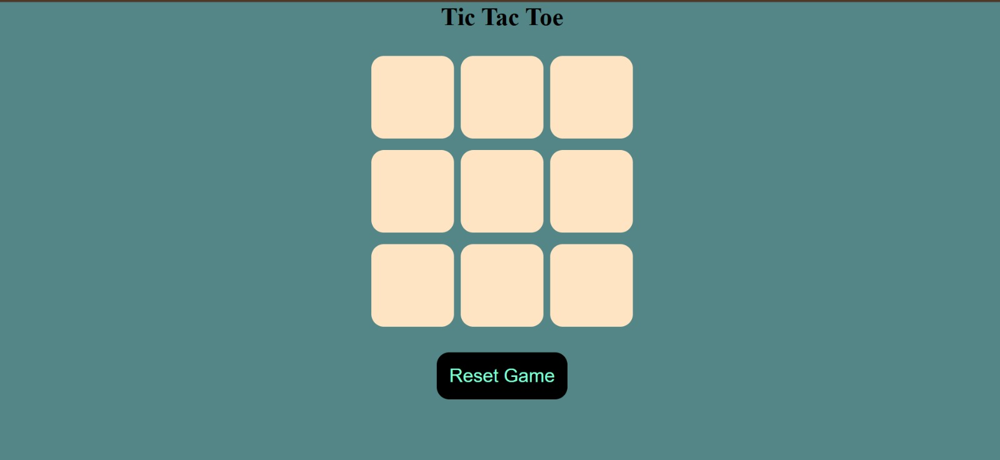
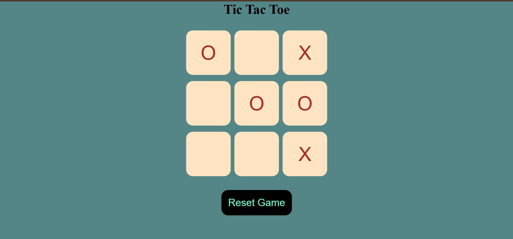
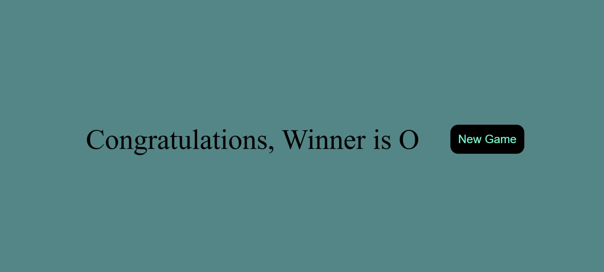

# 🎮 Tic Tac Toe Game – JavaScript Project ✨

Tic Tac Toe Game is a browser-based interactive web game developed using HTML, CSS, and Vanilla JavaScript.  
This project demonstrates core DOM manipulation, event handling, game logic implementation, and dynamic UI updates.

---

## 🚀 Features

🔹 Turn-based gameplay (X & O)  
🔹 Win pattern detection logic  
🔹 Automatic turn switching  
🔹 Disable box after selection  
🔹 Winner announcement screen 🎉  
🔹 Reset Game functionality 🔄  
🔹 New Game button  

---

## 🖥️ Tech Stack

### Frontend
🔹 HTML5  
🔹 CSS3  
🔹 Vanilla JavaScript  

---

## 📂 Project Structure

```
TicTacToe-Game-JavaScript/
│
├── index.html
├── style.css
├── game.js
└── assets (images)
```

---

## ⚙️ Game Workflow

User Click → Turn Switch (X/O) → Check Win Patterns →  
Display Winner Message → Reset / New Game Option

---

## 📸 Application Preview

### 🖥 Front Page


---

### ▶️ Running Game


---

### 🏆 Winner Screen


---

## ⚙️ Setup Instructions

1️⃣ Clone Repository  
```
git clone https://github.com/Pinkuu108/TicTacToe-Game-JavaScript.git
```

2️⃣ Open Folder  
Open in VS Code or any browser

3️⃣ Run  
Open `index.html` in your browser

---

## 🎯 Key Learning Highlights

🔹 DOM Manipulation  
🔹 Event Handling  
🔹 Game Logic Implementation  
🔹 Array-based Win Pattern Checking  
🔹 Clean UI Design  

---

## 👨‍💻 Author

**Pinku Prusty** ✨  
Java Developer  

🔗 LinkedIn: https://www.linkedin.com/in/pinkuna-prusty-55b487273/  
📧 Email: pinkunaprusty108@gmail.com  

---
